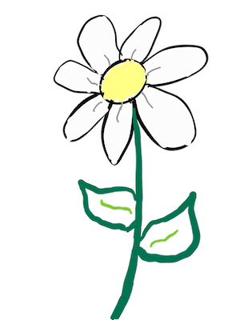

# daisylang
Daisy Programming Language



### Guiding Principles
+ Daisy should be **fun** to learn and use
+ Daisy should be **straightforward**
  - Easy to reason about
  - Easy to read
  - Easy to parse
+ Daisy should **explicit, not implicit**.
+ Snippets of Daisy should be **understandable** just by reading it
+ Daisy will be strongly **opinionated**
  - Most minor formatting will not be a matter of debate
  - Try to guide people toward being better programmers.

Above all, **_Daisy Should Smell Good_**

### Examples

What can be parsed right now can be seen in the [samples directory](samples/),
but here are a few snippets

```
Method: Integer fibonacci( n: Integer )
    if n <= 2
        return 1
    return fibonacci( n - 1 ) + fibonacci( n - 2 )

print( fibonacci( 10 ) )
```

### Todo

A whole lot remains to make this go, but the highlights are
+ Built-in types: Float, Dict
+ A bunch of built-in operators for those types
+ Rename some of the keywords
+ More contracts for built-in types
+ Contract checking, delegation
+ More reflection
+ switch/case
+ continue/break
+ Exception handling
+ Most error handling during parsing, interpretation (type safety, etc)
+ Mutability and constness checks
+ RAII-style scoping
+ *and more*
